# Практическое задание №6. Настройка протокола GRE

Выполнил Панков Н.О, группа ББМО-01-23

## Общая структурная схема сети

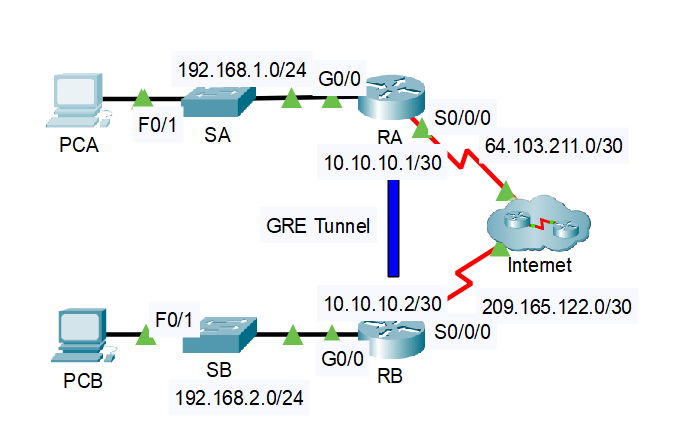

# Часть 1: Проверка подключения маршрутизатора

## Шаг 1: Определение IP-адреса порта S0/0/0 на маршрутизаторе RA.

```
show ip int br
```

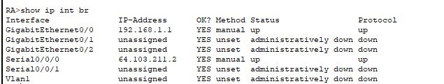

## Отправка эхо-запроса с RB на RA

```
ping 64.103.211.2
```


## Шаг 2: Определение IP-адреса на ПК А.

```
ipconfig
```

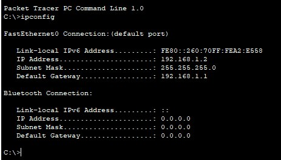

## Шаг 3: Отправка эхо-запроса до настройки туннеля GRE

```
ping 192.168.1.2
```

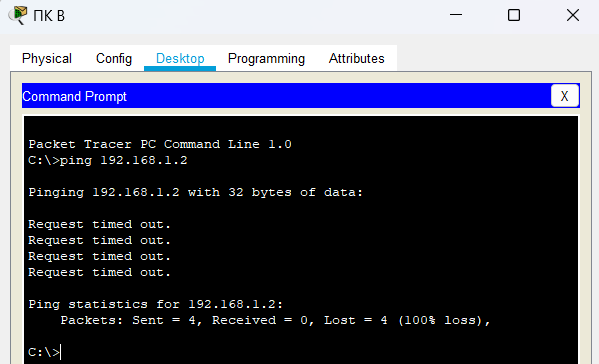


# Часть 2: Настройка туннеля GRE

## Шаг 1:  Настройка туннеля GRE на маршрутизаторе RA

```
enable

conf t

int tunnel 0

ip address 10.10.10.1 255.255.255.252

tunnel source s0/0/0

tunnel destination 209.165.122.2

tunnel mode gre ip
```

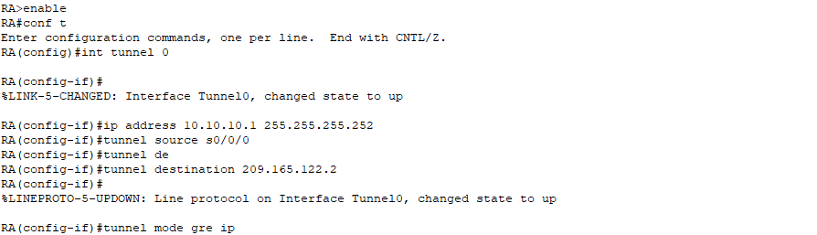

## Шаг 2: Настройка туннеля GRE на маршрутизаторе RB.

```
en

conf t

int tunnel 0

ip address 10.10.10.2 255.255.255.252

tunnel source s0/0/0

tunnel destination 64.103.211.2

tunnel mode gre ip

```

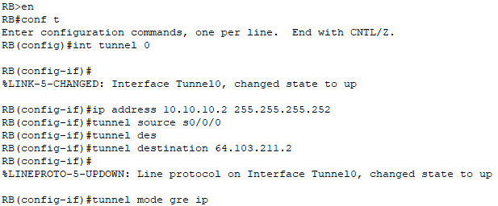

## Шаг 3: Настройте маршрут для частного IP-трафика.

```
conf t

ip route 192.168.2.0 255.255.255.0 10.10.10.2
```

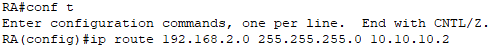

```
no shutdown

exit

ip route 192.168.1.0 255.255.255.0 10.10.10.1
```

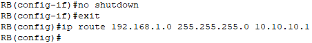

# Часть 3: Проверка подключения маршрутизатора

## Шаг 1: Отправка эхо-запроса с ПК B на ПК А после настройки GRE туннеля

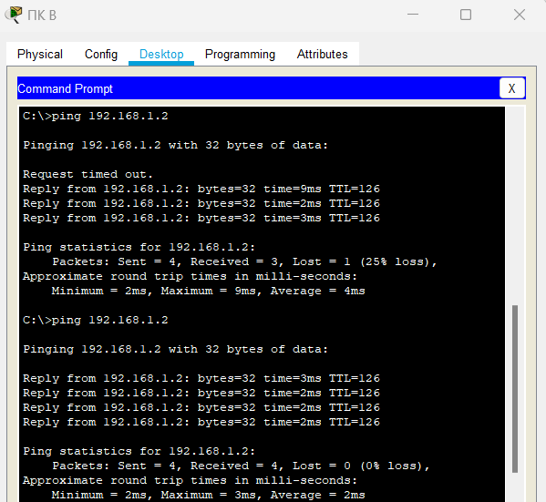

## Шаг 2: Трассировка от ПК А до ПК В

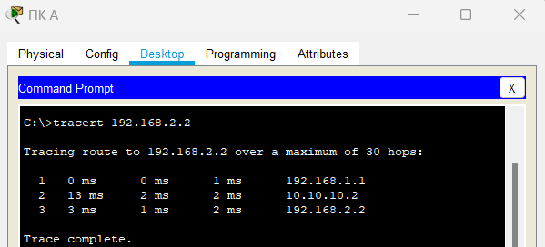

## Проверка правильности выполнения работы

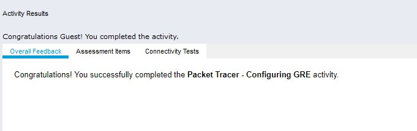
